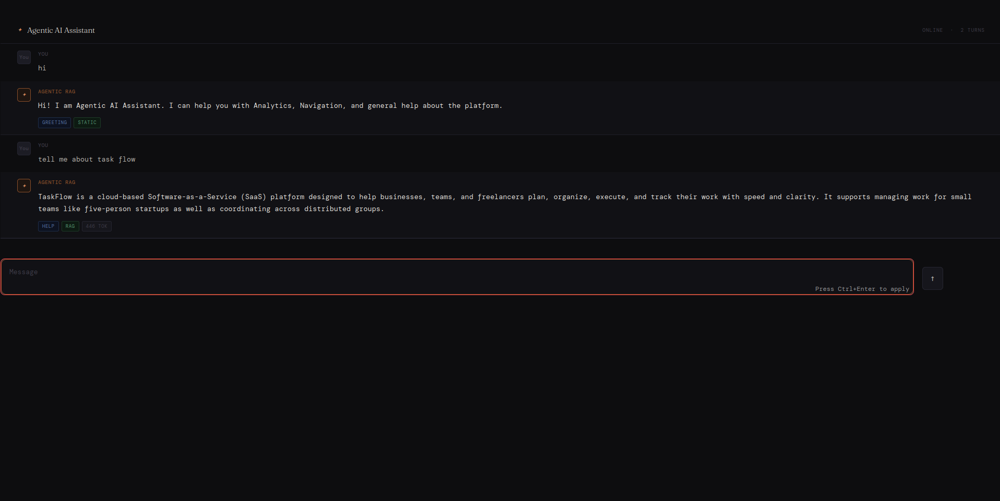
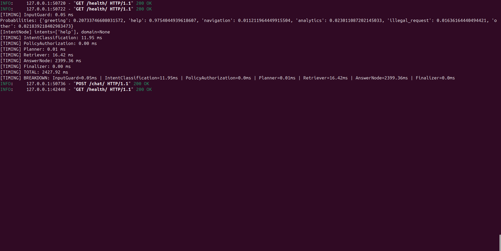
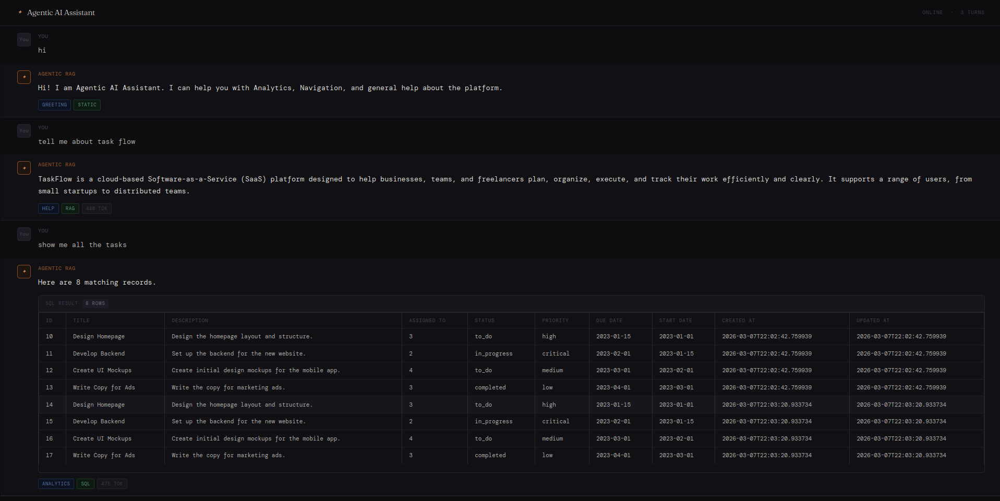
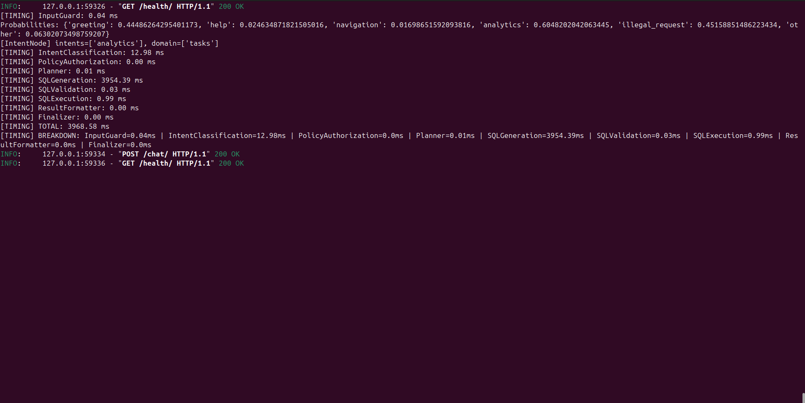

# Agentic RAG + SQL Analytics AI Assistant (FastAPI)

An **AI Agent built with FastAPI** that supports both **Retrieval-Augmented Generation (RAG)** and **SQL Analytics**.

The agent can:

* Answer questions using **uploaded documents**
* Generate and execute **SQL queries using database schemas**
* Return **analytics results directly from the database**
* Provide **fast responses (~2–3 seconds per query)**

The system is designed to **minimize LLM latency** by using **local embeddings, pgvector, and a lightweight intent classifier**.

---
# Demo





---
# Key Features

### Hybrid AI Agent

The assistant supports two major capabilities:

**1. Retrieval Augmented Generation (RAG)**

* Upload documents (`.md`, `.pdf`, `.json`)
* Documents are chunked and embedded
* Embeddings are stored locally in **PostgreSQL pgvector**
* Queries retrieve the most relevant chunks
* The LLM generates answers using retrieved context

---

**2. SQL Analytics Agent**

The AI can:

* Understand analytics questions
* Generate SQL queries from **database schema**
* Validate queries
* Execute them against the database
* Return structured results

Example queries:

```
How many tasks are overdue?
Show task completion stats
Which users created the most tasks?
```

---

# Performance Optimization

Typical AI pipelines take **8–10 seconds per query** due to multiple LLM calls:

| Step                | Typical Approach |
| ------------------- | ---------------- |
| Intent Recognition  | LLM              |
| Embedding           | API call         |
| RAG Retrieval       | DB               |
| Response Generation | LLM              |
| SQL Generation      | LLM              |

This project reduces latency to **~2–3 seconds**.

### How?

**Local Embeddings**

We use:

```
sentence-transformers/all-MiniLM-L6-v2
```

This model is used for:

* Query embeddings
* Document embeddings
* Intent recognition embeddings

This removes the need for **embedding API calls**.

---

### pgvector for Vector Search

Embeddings are stored in PostgreSQL using:

```
pgvector
```

This allows:

* fast cosine similarity search
* local vector storage
* no external vector database

---

### Fast Intent Recognition

Intent classification does **not use an LLM**.

Instead:

1. Intent dataset is converted to embeddings
2. A **Logistic Regression model** is trained
3. Queries are embedded and classified locally

This reduces intent detection time to **milliseconds**.

---

# Architecture

The project follows a **clean architecture design**.

```
Client (Streamlit)
       |
FastAPI API Layer
       |
AI Agent Graph
       |
--------------------------------
| Intent Recognition            |
| RAG Retriever                 |
| SQL Generator                 |
| SQL Executor                  |
--------------------------------
       |
PostgreSQL + pgvector
```

The AI agent is implemented as a **graph-based workflow**.

Nodes include:

* Input guard
* Intent recognition
* Policy authorization
* Planner
* Retriever
* SQL generator
* SQL validator
* SQL executor
* Result formatter
* Finalizer

---

# Project Structure

```
fastapi_agent/
├── main.py
├── requirements.txt
├── .env.example
├── knowledge_base/
└── app/
    ├── database.py
    ├── models/
    │   ├── chat_message.py
    │   └── rag_document.py
    ├── domain/
    │   ├── entities.py
    │   ├── enums.py
    │   ├── sql_schema_registry.py
    │   └── services/
    ├── infrastructure/
    │   ├── ai/
    │   ├── intent_recognition/
    │   ├── prompts/
    │   └── rag/
    └── application/
        ├── rag/
        ├── services/
        └── agent/
```

---

# Tech Stack

Backend

* FastAPI
* SQLAlchemy
* PostgreSQL
* pgvector

AI

* OpenAI
* sentence-transformers MiniLM-L6-v2
* Logistic Regression (intent classifier)

Frontend

* Streamlit

---

# Setup Guide

## 1. Clone the Repository

```
git clone <repo-url>
cd fastapi_agent
```

---

# 2. Install Dependencies

```
pip install -r requirements.txt
```

---

# 3. Configure Environment

Create `.env`:

```
OPENAI_API_KEY=sk-...
DATABASE_URL=postgresql://...
```

---

# 4. Enable pgvector in PostgreSQL

Run:

```sql
CREATE EXTENSION IF NOT EXISTS vector;
```

---

# 5. Train the Intent Recognition Model

The intent model artifacts must be generated before running the server.

Run from project root:

```
cd /home/hammad/Code/raw/new/fastapi_agent
```

Then execute:

```bash
python -c "
from pathlib import Path
from app.infrastructure.intent_recognition.trainer import train_intent_model

result = train_intent_model(
    dataset_path=Path('app/infrastructure/intent_recognition/intent_dataset.json'),
    artifacts_dir=Path('app/infrastructure/intent_recognition/artifacts'),
)
print(result.report)
print(f'Trained on {result.n_samples} samples')
"
```

This will generate:

```
artifacts/
    intent_mlb.joblib
    intent_clf.joblib
    intent_meta.joblib
```

Restart the server after training.

---

## Intent Dataset Format

If the dataset does not exist, create:

```
app/infrastructure/intent_recognition/intent_dataset.json
```

Example:

```json
[
  {"query": "hello", "target": {"intent": ["greeting"]}},
  {"query": "hi there", "target": {"intent": ["greeting"]}},
  {"query": "how do I use the dashboard", "target": {"intent": ["help"]}},
  {"query": "where is the tasks page", "target": {"intent": ["navigation"]}},
  {"query": "how many tasks are overdue", "target": {"intent": ["analytics"]}},
  {"query": "show me project stats", "target": {"intent": ["analytics"]}},
  {"query": "delete all users", "target": {"intent": ["illegal_request"]}},
  {"query": "what is the weather", "target": {"intent": ["other"]}}
]
```

For best accuracy:

```
20–30 examples per intent
```

---

# Knowledge Base

Documents for RAG are stored in:

```
knowledge_base/
```

Supported formats:

```
.md
.pdf
.json
```

Example:

```
knowledge_base/
    platform_guide.pdf
```

---

# Document Indexing

### Step 1 — Add Documents

Place files in:

```
knowledge_base/
```

---

### Step 2 — Run the Indexer

```
cd /home/hammad/Code/raw/new/fastapi_agent
python index_knowledge.py
```

Example output:

```
[1/4] Initializing database...
✓ Database ready

[2/4] Existing chunks in DB: 0

[3/4] Loading documents...
• platform_guide.md (platform)
• policy.pdf (policy)
✓ Loaded 2 document(s)

[4/4] Chunking and embedding...
Chunks to embed: 47

✅ Done. Indexed 47 chunks from 2 document(s).
```

---

### Re-index After Updating Files

```
python index_knowledge.py --fresh
```

This will:

* delete old chunks
* rebuild the entire vector index

---

# Run the API Server

```
uvicorn main:app --reload
```

Access documentation:

```
http://localhost:8000/docs
```

---

# API Endpoints

| Method | Endpoint                  | Description                    |
| ------ | ------------------------- | ------------------------------ |
| POST   | `/chat/`                  | Chat without history           |
| POST   | `/chat/with-history/`     | Chat with conversation history |
| POST   | `/admin/index-knowledge/` | Re-index knowledge base        |
| GET    | `/health/`                | Health check                   |
| GET    | `/docs`                   | Swagger API docs               |

---

# Running the Frontend

Install dependencies:

```
pip install streamlit requests
```

Run:

```
streamlit run streamlit_app.py
```

This launches a **Streamlit chat interface** for interacting with the AI agent.

---

# Customization

### Add SQL Database Schemas

Edit:

```
app/domain/sql_schema_registry.py
```

This defines the schemas the AI uses to generate SQL.

---

### Add Domain Keywords

Edit:

```
app/infrastructure/intent_recognition/domain_router.py
```

---

### Modify Prompts

Edit files inside:

```
app/infrastructure/prompts/
```

---

# Important Note

The **current documents and SQL schemas related to task flow are AI-generated examples** used for demonstration purposes only.

They **do not represent any real system, organization, or proprietary data**.

---

# Summary

This project demonstrates a **high-performance AI assistant** capable of:

* RAG over uploaded documents
* SQL analytics over databases
* Local embedding search with pgvector
* Fast intent classification
* Minimal LLM latency

The result is an **AI agent that responds in ~2–3 seconds instead of 8–10 seconds**, making it suitable for real-time applications.
